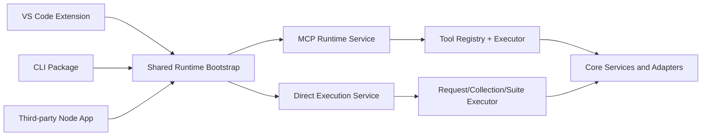

# Runtime Execution Solution

## Document Information

| Field | Value |
|---|---|
| Version | 1.0 |
| Last Updated | 2026-06-17 |
| Status | Implementation blueprint |
| Depends On | RUNTIME-EXECUTION-REQUIREMENTS.md |

---

## 1. Solution Summary

This solution introduces a shared runtime architecture that supports three consumption modes from one execution path:

1. VS Code extension-hosted MCP (existing path, kept compatible).
2. Terminal CLI (`mcp-server`, `run-request`, `run-collection`, `run-suite`).
3. Embeddable + direct library APIs (`createMcpRuntime`, `runRequest`, `runCollection`, `runSuite`).

The design keeps behavior parity by centralizing execution logic in reusable runtime services rather than duplicating extension-specific code.

---

## 2. Architecture Overview



### Core Principles

1. Single source of truth for execution flow.
2. Host-specific concerns only at adapter/bootstrap boundary.
3. Contract-first exports for runtime and direct APIs.
4. Backward compatibility for extension command/runtime behavior.

---

## 3. Component Design

### 3.1 Shared Runtime Bootstrap

Responsibilities:

1. Build core service container with platform adapters.
2. Configure workspace path, stores, watcher, notification, browser abstractions.
3. Expose resolved runtime dependencies needed by MCP/direct execution services.

Notes:

1. Existing extension bootstrap remains a valid host implementation.
2. CLI and external Node consumers use Node-native adapter implementations.

### 3.2 Embeddable MCP Runtime API

Proposed surface:

```typescript
export interface McpRuntimeOptions {
  workspaceFolder: string;
  port?: number;
  host?: string;
  configOverrides?: Record<string, unknown>;
}

export interface McpRuntimeHandle {
  start(): Promise<void>;
  stop(): Promise<void>;
  isRunning(): boolean;
  getPort(): number;
  executeTool(name: string, args?: Record<string, unknown>): Promise<unknown>;
}

export function createMcpRuntime(options: McpRuntimeOptions): Promise<McpRuntimeHandle>;
```

Implementation mapping:

1. Reuse MCP tool registry behavior and executor semantics.
2. Keep report URI generation and rewrite logic compatible with current outputs.
3. Preserve include/options behavior for request/collection/suite tools.

### 3.3 Direct Execution APIs (No MCP)

Proposed surface:

```typescript
export interface RunRequestOptions {
  workspaceFolder: string;
  collectionId: string;
  requestId: string;
  environment?: string;
  variables?: Record<string, unknown>;
  headers?: Record<string, string>;
  query?: Record<string, string>;
  body?: string;
  include?: string[];
}

export interface RunCollectionOptions {
  workspaceFolder: string;
  collectionId: string;
  environment?: string;
  variables?: Record<string, unknown>;
  iterations?: number;
  stopOnError?: boolean;
  delay?: number;
  include?: string[];
}

export interface RunSuiteOptions {
  workspaceFolder: string;
  suiteId: string;
  environment?: string;
  variables?: Record<string, unknown>;
  iterations?: number;
  stopOnError?: boolean;
  delay?: number;
  requestFilter?: string[];
  include?: string[];
}

export function runRequest(options: RunRequestOptions): Promise<unknown>;
export function runCollection(options: RunCollectionOptions): Promise<unknown>;
export function runSuite(options: RunSuiteOptions): Promise<unknown>;
```

Implementation mapping:

1. Delegate to shared execution services used by MCP tool path.
2. Return typed result objects and throw typed errors.
3. Keep response shapes aligned with MCP output payload semantics.

### 3.4 CLI Package

Commands:

1. `http-forge mcp-server [--port] [--host]`
2. `http-forge run-request --collection <id> --request <id> [options]`
3. `http-forge run-collection --collection <id> [options]`
4. `http-forge run-suite --suite <id> [options]`

Common options:

1. `--workspace <path>`
2. `--environment <name>`
3. `--output json|table`
4. `--include <value>` (repeatable)

Exit code model:

1. `0` success.
2. `1` runtime/config/validation failure.
3. `2` command usage/argument error.

---

## 4. Requirement-to-Solution Mapping

| Requirement Group | Solution Component |
|---|---|
| FR-CLI-* | CLI package command layer over shared runtime/direct APIs |
| FR-EMBED-* | Exported `createMcpRuntime` with lifecycle handle |
| FR-DIRECT-* | Exported direct execution functions |
| FR-COMPAT-* | Reuse current executor flow and output/report semantics |

---

## 5. Implementation Plan (Execution Order)

1. Define public runtime/direct API contracts in core exports.
2. Introduce Node host adapters and bootstrap for non-extension use.
3. Implement embeddable MCP runtime factory on shared services.
4. Implement direct execution APIs.
5. Create separate CLI package and wire subcommands to step 3 and 4 APIs.
6. Add tests for parity and filter argument correctness.
7. Update changelog and usage docs.

---

## 6. Verification Strategy

### 6.1 Parity Verification

1. Compare extension MCP tool outputs with CLI/runtime outputs for same inputs.
2. Verify include flags and report URI behavior consistency.
3. Verify collection iterations behavior parity with suite behavior.

### 6.2 API Verification

1. Validate runtime lifecycle methods (`start`, `stop`, `isRunning`, `getPort`).
2. Validate direct APIs execute without MCP server startup.
3. Validate library mode never calls `process.exit`.

---

## 7. Risks and Mitigations

| Risk | Impact | Mitigation |
|---|---|---|
| Drift between extension and CLI logic | Behavioral inconsistency | Force CLI to call shared runtime/direct APIs only |
| Contract churn for early adopters | Integration breakage | Publish stable v1 contracts and changelog notes |
| Host adapter differences | Runtime errors in non-VSCode host | Add adapter conformance tests and smoke tests |
| Output shape mismatch | Tooling breakage | Maintain schema parity and snapshot tests |

---

## 8. Related Files

- Existing extension MCP flow: `http-forge/src/infrastructure/mcp/mcp-server.ts`
- Existing extension executor flow: `http-forge/src/infrastructure/mcp/mcp-executor.ts`
- Extension composition root: `http-forge/src/infrastructure/services/service-bootstrap.ts`
- Core bootstrap/contracts: `http-forge.core/src/di/core-bootstrap.ts`, `http-forge.core/src/types/platform.ts`
- Requirements source: `http-forge/docs/RUNTIME-EXECUTION-REQUIREMENTS.md`
