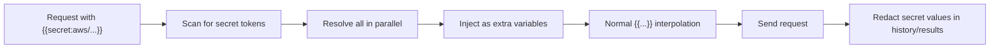

# Secret Providers (`{{secret:alias/path}}`)

HTTP Forge can pull secrets directly from external secret managers at request time using the
`{{secret:alias/path}}` token. The secret value is **never stored** in HTTP Forge config,
history, or result files — the provider fetches it on demand using your ambient credentials
and the resolved value is [redacted](security.md) before anything is written to disk.

This works identically in the **VS Code extension** and the **`@http-forge/cli`** standalone runner.

> Looking for simpler options? For per-developer secrets that don't need a cloud vault, see
> [OS Keychain secrets](environments-variables.md#os-keychain-secrets-recommended) and
> [Local secrets](environments-variables.md#local-secrets) in the Environments guide.

---

## Supported providers

| Alias (default) | Provider | Token syntax | Credentials (never in config) | SDK required |
|---|---|---|---|---|
| `aws` | AWS Secrets Manager | `{{secret:aws/<secretId>[#jsonField]}}` | SDK default chain (env, `~/.aws`, IAM role, ECS) | `@aws-sdk/client-secrets-manager` |
| `azure` | Azure Key Vault | `{{secret:azure/<name>[/<version>]}}` | `DefaultAzureCredential` (env, managed identity, CLI) | `@azure/keyvault-secrets`, `@azure/identity` |
| `gcp` | Google Secret Manager | `{{secret:gcp/<name>[/versions/<n>]}}` | Application Default Credentials | `@google-cloud/secret-manager` |
| `vault` | HashiCorp Vault (KV v2) | `{{secret:vault/<path>[#field]}}` | `VAULT_TOKEN` + `VAULT_ADDR` | none (built-in `fetch`) |
| `op` | 1Password | `{{secret:op/<item>/<field>}}` | `op` CLI session or `OP_SERVICE_ACCOUNT_TOKEN` | none (CLI) / optional `@1password/sdk` |
| `doppler` | Doppler | `{{secret:doppler/<NAME>}}` | `DOPPLER_TOKEN` service token | none (built-in `https`) |

All six aliases are **pre-registered out of the box** — you can use `{{secret:aws/...}}` etc.
with zero configuration as long as the matching credentials/environment variables are present.
See [Zero-config defaults](#zero-config-defaults).

---

## How it works

1. Before a request runs, `RequestPreparer` scans the whole request (URL, headers, query, body,
   auth) for `{{secret:alias/path}}` tokens.
2. All distinct tokens are resolved **in parallel**, _before_ normal `{{variable}}` interpolation.
3. Each resolved value is injected as an extra variable, so the normal (synchronous) template
   engine substitutes it transparently — exactly like any other `{{...}}` token.
4. Values are **cached for the lifetime of a single request** so the same secret isn't fetched twice.
5. If a token's alias isn't configured, or the provider call fails, a warning is logged and the
   token is **left as-is** in the output (visible in history as an unresolved template). The
   request is not aborted.



**No credentials are ever stored in HTTP Forge config.** Each provider uses its own
ambient credential chain (env vars, cloud identity, CLI session). The `secrets` block only
holds non-sensitive routing info such as region, vault URL, or project ID.

---

## Installing the provider SDKs

Three providers (Vault, Doppler, 1Password-via-CLI) need **no npm package**. The cloud SDKs
(AWS, Azure, GCP) are **not bundled** with the extension to keep it slim — they're loaded
on demand from your project.

### In the CLI (`@http-forge/cli`)

The SDKs are declared as `optionalDependencies`, so install only the ones you use:

```bash
npm install @aws-sdk/client-secrets-manager      # AWS
npm install @azure/keyvault-secrets @azure/identity   # Azure
npm install @google-cloud/secret-manager         # GCP
```

### In the VS Code extension

The extension loads SDKs from your **project's** `node_modules`, resolved through the first
`scripts.modulePaths` entry that contains a `package.json`. Install the SDK there:

```jsonc
// http-forge.config.json
{
  "scripts": { "modulePaths": ["./http-forge-assets/lib"] }
}
```

```bash
cd http-forge-assets/lib
npm install @aws-sdk/client-secrets-manager
```

If an SDK is missing, the resolver throws a clear message telling you exactly which package to install.

---

## Configuration

Add a `secrets.providers` block to `http-forge.config.json`. The **key** is the alias used in
the token (`{{secret:<alias>/...}}`); the `provider` field selects the implementation.

```json
{
  "secrets": {
    "providers": {
      "aws":     { "provider": "aws",       "region": "us-east-1" },
      "azure":   { "provider": "azure",     "vaultUrl": "https://my-vault.vault.azure.net" },
      "gcp":     { "provider": "gcp",       "projectId": "my-project-123" },
      "vault":   { "provider": "vault",     "address": "https://vault.corp.com", "mountPath": "secret", "namespace": "admin" },
      "op":      { "provider": "1password", "vault": "Private" },
      "doppler": { "provider": "doppler" }
    }
  }
}
```

Alias and provider type are independent — you can register the **same provider under multiple
aliases** with different settings:

```json
{
  "secrets": {
    "providers": {
      "aws-us": { "provider": "aws", "region": "us-east-1" },
      "aws-eu": { "provider": "aws", "region": "eu-west-1" }
    }
  }
}
```

Then `{{secret:aws-eu/myapp/token}}` reads from `eu-west-1`.

### Merge & precedence

Your `secrets.providers` are deep-merged over the [zero-config defaults](#zero-config-defaults)
**per alias**. Defining an alias replaces that alias's default entry entirely; aliases you don't
touch keep their defaults. Within a provider, any field you omit falls back to its environment
variable (see each provider below), following this precedence:

> user config → default config → environment variable → built-in default / fail

---

## Provider setup

### AWS Secrets Manager

```json
{ "aws": { "provider": "aws", "region": "us-east-1" } }
```

- **Credentials:** AWS SDK v3 default chain — env vars → `~/.aws/credentials` → IAM instance role → ECS task role.
- **`region`** falls back to `AWS_DEFAULT_REGION` → `AWS_REGION`.
- **Token:** `{{secret:aws/<secretId>}}` returns the raw `SecretString`.
- **JSON field:** for a JSON secret, append `#field` → `{{secret:aws/myapp/prod#db_password}}`.

### Azure Key Vault

```json
{ "azure": { "provider": "azure", "vaultUrl": "https://my-vault.vault.azure.net" } }
```

- **Credentials:** `DefaultAzureCredential` — env vars → managed identity → Azure CLI → VS Code login.
- **`vaultUrl`** falls back to `AZURE_KEYVAULT_URL` (an empty/omitted value triggers the fallback).
- **Token:** `{{secret:azure/<secretName>}}`, or pin a version with `{{secret:azure/<secretName>/<version>}}`.

### Google Secret Manager

```json
{ "gcp": { "provider": "gcp", "projectId": "my-project-123" } }
```

- **Credentials:** Application Default Credentials — `GOOGLE_APPLICATION_CREDENTIALS` → gcloud CLI → Workload Identity → metadata server.
- **`projectId`** falls back to `GOOGLE_CLOUD_PROJECT` → `GCLOUD_PROJECT` → `GCP_PROJECT`.
- **Token:** `{{secret:gcp/<secretName>}}` (latest), or `{{secret:gcp/<secretName>/versions/3}}` for a specific version.

### HashiCorp Vault (KV v2)

```json
{ "vault": { "provider": "vault", "address": "https://vault.corp.com", "mountPath": "secret", "namespace": "admin" } }
```

- **No SDK needed** — uses built-in `fetch` against the KV v2 API (`/v1/<mountPath>/data/<path>`).
- **Credentials:** `VAULT_TOKEN` (required). **`address`** falls back to `VAULT_ADDR` (default `http://127.0.0.1:8200`).
- **`mountPath`** defaults to `secret`. **`namespace`** (Enterprise/HCP) is sent as `X-Vault-Namespace` and falls back to `VAULT_NAMESPACE`.
- **Token:** `{{secret:vault/<path>}}` returns the `value` key; pin a field with `#field` → `{{secret:vault/myapp/prod#db_password}}`.

### 1Password

```json
{ "op": { "provider": "1password", "vault": "Private" } }
```

- **Credentials:** the `op` CLI signed-in session, or a Service Account via `OP_SERVICE_ACCOUNT_TOKEN` (CI). With a service-account token and `@1password/sdk` installed, the SDK path is used; otherwise it shells out to `op`.
- **`vault`** sets a default vault so tokens can omit it: with it → `{{secret:op/<item>/<field>}}`; without it → `{{secret:op/<vault>/<item>/<field>}}`.

### Doppler

```json
{ "doppler": { "provider": "doppler" } }
```

- **No SDK needed** — uses built-in `https` against the Doppler REST API.
- **Credentials:** `DOPPLER_TOKEN` service token (project/config are baked into the token). Override per-alias with `serviceToken`.
- **Token:** `{{secret:doppler/<NAME>}}` — the name is upper-cased automatically (`{{secret:doppler/api_key}}` → `API_KEY`).

---

## Zero-config defaults

Even with **no `secrets` block**, all six aliases are pre-registered with minimal settings, so
they work as soon as the matching credentials/env vars are present:

| Alias | Reads from |
|---|---|
| `aws` | `AWS_REGION` + SDK credential chain |
| `azure` | `AZURE_KEYVAULT_URL` + `DefaultAzureCredential` |
| `gcp` | `GOOGLE_CLOUD_PROJECT` + Application Default Credentials |
| `vault` | `VAULT_ADDR` + `VAULT_TOKEN` |
| `op` | `op` CLI session |
| `doppler` | `DOPPLER_TOKEN` |

Add a `secrets` block only when you need to pin a region/URL/project or register extra aliases.

---

## Usage in requests

Use a secret token anywhere a `{{variable}}` is allowed — URL, headers, query params, or body:

```http
GET {{baseUrl}}/users
Authorization: Bearer {{secret:aws/prod/myapp/api-token}}
X-Tenant-Key: {{secret:vault/myapp/prod#tenantKey}}
X-Vault-Item: {{secret:op/prod-db/password}}
```

```jsonc
// JSON body
{
  "clientSecret": "{{secret:azure/oauth-client-secret}}",
  "dopplerKey": "{{secret:doppler/STRIPE_KEY}}"
}
```

You can mix secret tokens with normal variables and filters freely.

---

## CLI usage

The same tokens resolve in `@http-forge/cli`. Make sure the required env vars/credentials and any
needed SDKs are available in the shell that runs the CLI:

```bash
# AWS — SDK installed + credentials in env / IAM role
AWS_REGION=us-east-1 npx @http-forge/cli run-suite smoke --env prod

# Vault — no SDK needed
VAULT_ADDR=https://vault.corp.com VAULT_TOKEN=$VAULT_TOKEN \
  npx @http-forge/cli run-suite smoke --env prod

# Doppler — no SDK needed
DOPPLER_TOKEN=$DOPPLER_TOKEN npx @http-forge/cli run-suite smoke --env prod
```

---

## CI/CD

No secrets are stored in HTTP Forge config, so pipelines just need to expose the provider's
own credentials to the environment:

```yaml
# GitHub Actions — AWS via OIDC role, no secrets in config
- uses: aws-actions/configure-aws-credentials@v4
  with:
    role-to-assume: ${{ secrets.AWS_ROLE_ARN }}
    aws-region: us-east-1
- run: |
    npm install @aws-sdk/client-secrets-manager
    npx @http-forge/cli run-suite smoke --env prod
```

```yaml
# HashiCorp Vault — token from the CI secret store
- env:
    VAULT_ADDR: https://vault.corp.com
    VAULT_TOKEN: ${{ secrets.VAULT_TOKEN }}
  run: npx @http-forge/cli run-suite smoke --env prod
```

---

## Security

- Secret values are **never written** to config, history, or result files — they're
  [redacted](security.md) after resolution.
- Provider **credentials are never read from HTTP Forge config** — only from the environment,
  cloud identity, or a CLI session.
- A failed or unconfigured token is left unresolved (and logged) rather than silently sending
  an empty value.

See [Security & Sensitive Data](security.md) for the full redaction model.

---

## Troubleshooting

| Symptom | Likely cause / fix |
|---|---|
| Token appears unresolved in history | Alias not configured, or provider call failed — check the warning logged at run time. |
| `requires @aws-sdk/client-secrets-manager` (or similar) | SDK not installed. Install it in the CLI project or the extension's `modulePaths` folder. |
| Azure: "no vault URL configured" | Set `vaultUrl` or `AZURE_KEYVAULT_URL`. |
| GCP: "no projectId configured" | Set `projectId` or `GOOGLE_CLOUD_PROJECT`. |
| Vault: "requires VAULT_TOKEN" | Export `VAULT_TOKEN` (and `VAULT_ADDR` if not default). |
| 1Password: "requires `op` CLI" | Install the 1Password CLI and run `op signin`, or set `OP_SERVICE_ACCOUNT_TOKEN`. |
| Doppler: "no service token found" | Set `DOPPLER_TOKEN` or add `serviceToken` to the alias config. |

See also [Troubleshooting & FAQs](troubleshooting.md).
